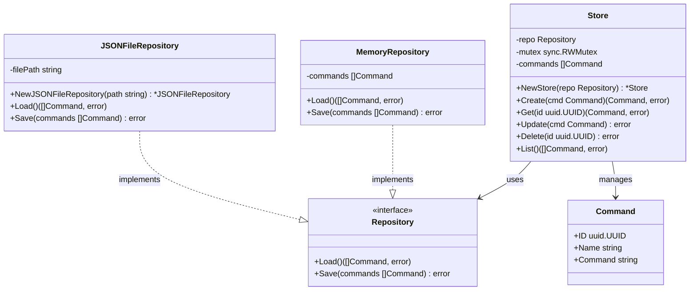

# Spec: Command Definition

## Purpose
Provide an interface to manage command definitions that can be stored and later used to create processes. The feature abstracts storage implementation, allowing commands to be created, retrieved, updated, deleted, and listed independently of the underlying persistence mechanism.

## Rationale
The ai-sensors project needs a way to persist command configurations so they can be reused to spawn processes. This feature provides a clean API layer that decouples command management from storage details, enabling future flexibility in how commands are persisted (in-memory, file-based, database, etc.).

## Package
- **Location:** `command/`
- **Type:** New

---

## Architecture



---

## Test Scenarios

### Store Tests (using MemoryRepository)

These tests validate business logic. They use `MemoryRepository` to isolate Store behavior from file I/O.

#### Happy Path

1. **Create a new command definition**
   - Given: A command store is initialized
   - When: A command definition is created with name and command string
   - Then: The command is stored with an auto-generated UUID v7 and returned

2. **Retrieve an existing command definition**
   - Given: A command store contains a previously created command
   - When: The command is retrieved by its UUID
   - Then: The complete command definition is returned with all fields

3. **Update an existing command definition**
   - Given: A command store contains a previously created command
   - When: The command is updated with a new name or command string
   - Then: The updated values are persisted and returned on subsequent retrieval

4. **Delete an existing command definition**
   - Given: A command store contains a previously created command
   - When: The command is deleted by its UUID
   - Then: The command is removed and subsequent retrieval returns not found

5. **List all command definitions**
   - Given: A command store contains multiple commands
   - When: All commands are listed
   - Then: A slice of all stored command definitions is returned

#### Edge Cases

1. **Create with empty/nil inputs**
   - Given: A command store is initialized
   - When: A command is created with empty name or command string
   - Then: An appropriate validation error is returned

2. **Retrieve non-existent command**
   - Given: A command store is empty or does not contain the given UUID
   - When: The command is retrieved by a random UUID
   - Then: A not found error is returned

3. **Update non-existent command**
   - Given: A command store does not contain the given UUID
   - When: An update is attempted for a random UUID
   - Then: A not found error is returned

4. **Delete non-existent command**
   - Given: A command store does not contain the given UUID
   - When: A delete is attempted for a random UUID
   - Then: A not found error is returned

5. **Concurrent access safety**
   - Given: A command store is initialized
   - When: Multiple goroutines perform CRUD operations concurrently
   - Then: All operations complete without data races or corruption

### JSONFileRepository Tests

These tests validate file persistence separately from Store logic. Critical to ensure the JSON implementation works correctly.

#### Happy Path

1. **Save and Load roundtrip**
   - Given: A JSONFileRepository with a temp file path
   - When: Commands are saved then loaded
   - Then: The loaded commands match the saved commands (including UUIDs)

2. **File is created on first Save**
   - Given: A JSONFileRepository with a path to a non-existent file
   - When: Save is called with commands
   - Then: The file is created with valid JSON content

3. **Load from existing file**
   - Given: A JSON file with valid command data exists
   - When: Load is called
   - Then: Commands are correctly deserialized with proper UUID parsing

#### Edge Cases

4. **Load from non-existent file**
   - Given: A JSONFileRepository with a path to a non-existent file
   - When: Load is called
   - Then: An empty slice is returned (no error)

5. **Load from empty file**
   - Given: A JSONFileRepository with a path to an empty file
   - When: Load is called
   - Then: An empty slice is returned (no error)

6. **Save empty list**
   - Given: A JSONFileRepository with a temp file path
   - When: Save is called with an empty slice
   - Then: The file contains an empty JSON array `[]`

7. **Load with malformed JSON**
   - Given: A file containing invalid JSON
   - When: Load is called
   - Then: An appropriate error is returned

---

## Technical Considerations

### Inputs

| Input | Type | Source | Validation |
|-------|------|--------|------------|
| id | uuid.UUID | Auto-generated | UUID v7 format, unique |
| name | string | Caller | Non-empty |
| command | string | Caller | Non-empty |

### Outputs

| Output | Type | Description |
|--------|------|-------------|
| Command | struct | The command definition with ID (uuid.UUID), Name, Command fields |
| []Command | slice | List of all stored command definitions |
| error | error | Validation or not found errors |

### Data Structures

```go
import "github.com/google/uuid"

// Command represents a stored command definition
type Command struct {
    ID      uuid.UUID
    Name    string
    Command string
}

// Store provides CRUD operations for commands with business logic
type Store struct {
    repo Repository
}

func NewStore(repo Repository) *Store

func (s *Store) Create(cmd Command) (Command, error)  // Returns command with generated ID
func (s *Store) Get(id uuid.UUID) (Command, error)
func (s *Store) Update(cmd Command) error
func (s *Store) Delete(id uuid.UUID) error
func (s *Store) List() ([]Command, error)

// Repository abstracts the underlying storage mechanism
type Repository interface {
    Load() ([]Command, error)   // Load all commands from storage
    Save([]Command) error       // Persist all commands to storage
}
```

### UUID Generation

- IDs are auto-generated using UUID v7 (`uuid.NewV7()`) on Create
- UUID v7 provides time-ordered unique identifiers (RFC 9562)
- Dependency: `github.com/google/uuid` v1.6.0

### Repository Implementations

| Implementation | Use Case | Description |
|----------------|----------|-------------|
| `MemoryRepository` | Unit tests | In-memory storage, no persistence |
| `JSONFileRepository` | Production | Persists commands to a JSON file |

**JSONFileRepository:**
- Takes a file path as constructor argument
- Creates the file if it doesn't exist
- Reads/writes the entire file on Load/Save

### Processing Rules

1. All CRUD operations must be thread-safe
2. IDs are auto-generated using UUID v7 on Create (guaranteed unique)
3. Required fields (Name, Command) must be non-empty
4. Errors are returned to the caller without logging at this layer

### Error Paths

| Condition | Handling | Recovery |
|-----------|----------|----------|
| Empty/nil required field (name, command) | Return validation error | Caller provides valid input |
| UUID not found on get/update/delete | Return not found error | Caller verifies UUID exists |

---

## Dependencies

- **Depends on:** `github.com/google/uuid` v1.6.0
- **Used by:** `manager/` (to load command definitions for process creation), `server/` (to expose CRUD API endpoints)

---

## Implementation Notes

- `Store` holds commands in memory and delegates persistence to `Repository`
- `Store` uses `sync.RWMutex` for concurrent access protection
- `MemoryRepository`: simple slice storage, useful for unit tests
- `JSONFileRepository`: reads/writes JSON file, used in production
- The `Repository` interface allows adding new storage backends (SQLite, etc.) without changing `Store`
