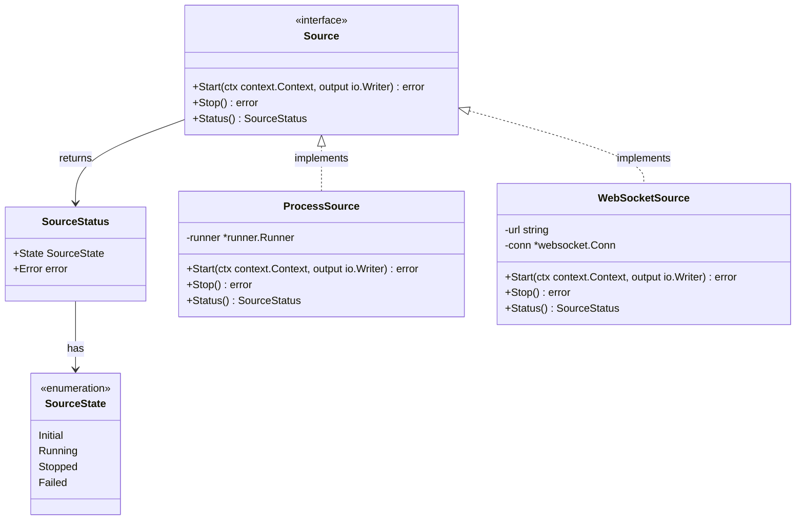

# Spec: Source Abstraction

## Purpose
Introduce a `Source` interface that abstracts data producers from ring buffers, allowing different types of inputs (not just process execution) to feed data into the ring buffer mechanism.

## Rationale
Currently, the ring buffer mechanism is tightly coupled to process execution via the Runner. The only way to write data to a ring buffer is through a command that spawns a process. This limits the system to process-based data sources only.

Real-world use cases require flexibility to ingest data from various sources:
- WebSocket connections receiving streaming data
- Sensor inputs with direct data feeds
- Log file tailing
- Message queues (RabbitMQ, Kafka, etc.)
- HTTP streaming (Server-Sent Events, chunked responses)

## Package
- **Location:** `source/`
- **Type:** New

---

## Architecture



### Data Flow

```
┌─────────────────────────────────────────────────────────────┐
│                    Manager                                   │
│  ┌──────────────────────────────────────────────────────┐   │
│  │  Instance                                            │   │
│  │  ┌────────────────────────────────────────────────┐ │   │
│  │  │ Source (interface)                            │ │   │
│  │  │  • ProcessSource (wraps Runner)               │ │   │
│  │  │  • WebSocketSource                            │ │   │
│  │  │  • FileWatchSource                            │ │   │
│  │  │  • ...                                        │ │   │
│  │  └────────────────────────────────────────────────┘ │   │
│  │            ↓ writes to                              │   │
│  │  ┌────────────────────────────────────────────────┐ │   │
│  │  │ RingBuffer (io.Writer)                        │ │   │
│  │  │  • No changes needed                          │ │   │
│  │  └────────────────────────────────────────────────┘ │   │
│  └──────────────────────────────────────────────────────┘   │
└─────────────────────────────────────────────────────────────┘
```

---

## Test Scenarios

### Source Interface Tests

#### Happy Path

1. **Start a source and receive data**
   - Given: A source implementation is initialized
   - When: Start is called with a context and output writer
   - Then: The source begins producing data to the writer

2. **Stop a running source**
   - Given: A source is running
   - When: Stop is called
   - Then: The source stops gracefully and status reflects Stopped state

3. **Query source status**
   - Given: A source in any state
   - When: Status is called
   - Then: Returns current state and any error information

#### Edge Cases

1. **Start with cancelled context**
   - Given: A source implementation
   - When: Start is called with an already cancelled context
   - Then: Returns appropriate error

2. **Stop an already stopped source**
   - Given: A source that has already been stopped
   - When: Stop is called again
   - Then: Returns without error (idempotent)

3. **Context cancellation during operation**
   - Given: A running source
   - When: The context is cancelled
   - Then: Source stops and status reflects the cancellation

### ProcessSource Tests

1. **Wraps existing Runner behavior**
   - Given: A ProcessSource with command configuration
   - When: Start is called
   - Then: Behaves identically to current Runner implementation

### WebSocketSource Tests (example implementation)

1. **Connect and receive messages**
   - Given: A WebSocketSource with a valid URL
   - When: Start is called
   - Then: Connects to WebSocket and writes received messages to output

2. **Handle connection errors**
   - Given: A WebSocketSource with an invalid URL
   - When: Start is called
   - Then: Returns connection error and status reflects Failed state

---

## Technical Considerations

### Inputs

| Input | Type | Source | Validation |
|-------|------|--------|------------|
| ctx | context.Context | Caller | Non-nil |
| output | io.Writer | Caller (typically RingBuffer) | Non-nil |

### Outputs

| Output | Type | Description |
|--------|------|-------------|
| SourceStatus | struct | Current state and error information |
| error | error | Operation errors |

### Data Structures

```go
// SourceState represents the lifecycle state of a source
type SourceState int

const (
    SourceStateInitial SourceState = iota
    SourceStateRunning
    SourceStateStopped
    SourceStateFailed
)

// SourceStatus contains the current status of a source
type SourceStatus struct {
    State SourceState
    Error error
}

// Source represents any data producer that can write to a buffer
type Source interface {
    // Start begins producing data, writing to the provided writer
    Start(ctx context.Context, output io.Writer) error
    // Stop gracefully stops the source
    Stop() error
    // Status returns the current state of the source
    Status() SourceStatus
}
```

### Processing Rules

1. All Source implementations must be thread-safe
2. Start should be non-blocking (data production happens in goroutines)
3. Stop must be idempotent
4. Context cancellation must be respected

### Error Paths

| Condition | Handling | Recovery |
|-----------|----------|----------|
| Nil context | Return error | Caller provides valid context |
| Nil output writer | Return error | Caller provides valid writer |
| Source already running | Return error or no-op | Caller checks status first |
| Connection/IO failure | Set Failed state, return error | Caller can retry or handle |

---

## Dependencies

- **Depends on:** `context`, `io`
- **Used by:** `manager/` (to manage source instances)

---

## Implementation Notes

- `RingBuffer` already implements `io.Writer`, no changes needed
- `ProcessSource` wraps the existing `Runner` to implement `Source`
- Manager would be refactored to work with `Source` instead of `Runner` directly
- This enables future source types without modifying core buffer logic

---

## Open Questions

- Should multiple sources be able to write to the same buffer?
- How should source configuration be stored/managed?
- Should there be a SourceFactory pattern for creating sources from configuration?
